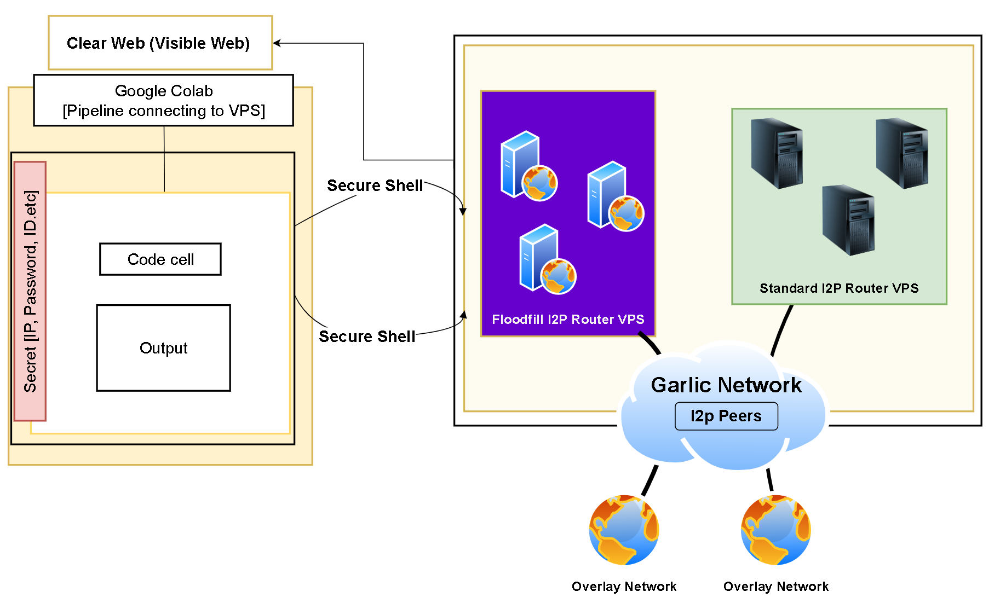

# The Emerging Network Topology of the Invisible Internet Project: Mathematical Modeling and Empirical Validation

  

This repository accompanies the research paper:

> **The Emerging Network Topology of the Invisible Internet Project: Mathematical Modeling and Empirical Validation**

The work investigates how the **Invisible Internet Project (I2P)** forms, evolves, and stabilizes at the **network layer**, combining **mathematical modeling** with **empirical observations** derived from live I2P router behavior.

---

## Purpose of this Repository

This GitHub repository serves as a **research companion**, not a finished software product.

It is intended to:

- Document the **models, assumptions, and system design choices** used in the study  
- Support **reproducibility and transparency** of the empirical analysis  
- Provide a structured home for **analysis scripts, figures, and methodology notes**
- Enable **future extensions** as the paper evolves or is validated further

> The paper and this repository are **actively evolving**. Some components are intentionally minimal or conceptual at this stage.

---

## Research Focus

The study addresses the following core questions:

- How does I2P’s peer selection and tunnel construction shape its **global network topology**?
- Can the observed topology be explained using **graph-theoretic and probabilistic models**?
- How closely do **empirical observations** align with the proposed mathematical abstractions?
- What structural properties (e.g., clustering, degree imbalance, persistence) emerge over time?

This work focuses strictly on the **network layer** of I2P (routers, tunnels, peers), not application-layer services such as eepsites.

---

## Conceptual Overview

At a high level, the paper models I2P as a **dynamic, partially observable graph**:

- **Vertices (nodes):** I2P routers
- **Edges:** Temporary tunnel relationships
- **Edge persistence:** Time-bounded and role-dependent
- **Topology evolution:** Driven by peer profiling, capacity, and tunnel lifetimes

Empirical data is used to **validate**, **stress-test**, and **refine** these abstractions.

---

## Repository Structure

The repository is organized to separate **conceptual material**, **analysis artifacts**, and **supporting code**.

> Folder names and contents may expand as the paper progresses.

---

## Mathematical Modeling Component

The modeling component explores:

- Degree distribution under constrained peer selection
- Probabilistic tunnel attachment mechanisms
- Temporal graph behavior under short-lived edges
- Emergent properties such as **hub formation**, **selection bias**, and **structural persistence**

All assumptions used in the models are **explicitly stated** and tested against observed behavior where possible.

---

## Empirical Validation Component

Empirical validation is performed through:

- Observation of live I2P routers under controlled configurations
- Extraction of tunnel participation patterns
- Longitudinal analysis of peer appearance and disappearance
- Comparison between **expected** and **observed** structural properties

No payload content or application-layer data is collected.

---

## Ethics and Responsible Measurement

This research follows strict ethical guidelines:

- No interception or decryption of user content
- Only router-level metadata is observed
- Measurements are rate-limited to avoid network disruption
- Anonymization is applied where appropriate

The goal is **scientific understanding**, not surveillance.

---

## Current Status

- Core mathematical framework defined  
- Initial empirical observations completed  
- Extended validation and refinement in progress  
- Figures and analysis notebooks under active development  

This repository will be updated as the manuscript matures.

---

## How to Use This Repository

You may use this repository to:

- Understand the **methodological structure** of the study
- Follow the **modeling and validation logic**
- Reproduce selected figures (when scripts are provided)
- Extend the models for comparative or follow-up research

If you build upon this work, proper citation is expected.

---

## Citation (Preliminary)

Citation details will be finalized upon publication.

For now, please cite the working paper as:

> Siddique A. Muntaka. *The Emerging Network Topology of the Invisible Internet Project: Mathematical Modeling and Empirical Validation*. Manuscript in preparation.

---

## Acknowledgments

This work benefits from academic infrastructure, open-source tools, and the broader I2P research community.

---

## License

Unless otherwise stated:

- **Code:** Research-use license (see `LICENSE`)
- **Figures and text:** © Authors

---

## Contact

For academic correspondence, collaboration, or clarification related to this research, please contact the author through appropriate scholarly channels.

