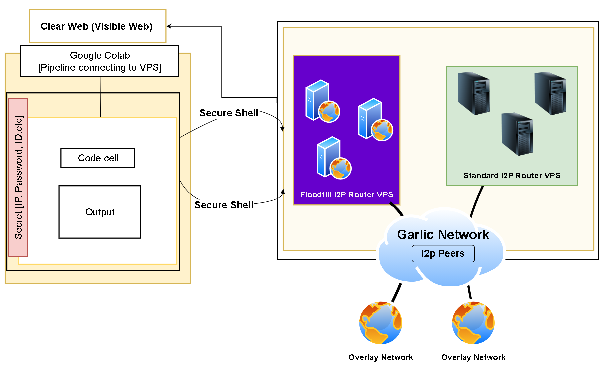

# Bridging the Epistemic Gap in the Invisible Internet: Extended Mathematical Modeling and Empirical Characterization of I2P Topology

  

This repository accompanies the research paper:

> **Bridging the Epistemic Gap in the Invisible Internet: Extended Mathematical Modeling and Empirical Characterization of I2P Topology**

The work investigates how the **Invisible Internet Project (I2P)** forms, evolves, and stabilizes at the **network layer**, combining **mathematical modeling** with **empirical observations** derived from live I2P router behavior. Specifically, it derives an Extended Mathematical Model (EMM) grounded in production source code and validated against a six-router, geographically distributed testbed operated over thirty days.

---

## Purpose of this Repository

This GitHub repository serves as a **research companion**, not a finished software product.

It is intended to:

- Document the **models, assumptions, and system design choices** used in the study  
- Support **reproducibility and transparency** of the empirical analysis  
- Provide a structured home for **analysis notebooks, validation data, and deployment scripts**
- Enable **future extensions** as the paper evolves or is validated further

---

## Research Focus

The study addresses the following core questions:

- How does I2P's peer selection and tunnel construction shape its **global network topology**?
- Can the observed topology be explained using **graph-theoretic and probabilistic models**?
- How closely do **empirical observations** align with the proposed mathematical abstractions?
- What structural properties (e.g., clustering, degree imbalance, persistence) emerge over time?

This work focuses strictly on the **network layer** of I2P (routers, tunnels, peers), not application-layer services such as eepsites.

---

## Conceptual Overview

At a high level, the paper models I2P as a **dynamic, partially observable graph**:

- **Vertices (nodes):** I2P routers
- **Edges:** Temporary tunnel relationships
- **Edge persistence:** Time-bounded and role-dependent
- **Topology evolution:** Driven by peer profiling, capacity, and tunnel lifetimes

Empirical data is used to **validate**, **stress-test**, and **refine** these abstractions.

---

## Repository Structure

    I2PEMM/
    ├── data/
    │   ├── EMM - Final Sheet.xlsx          — Validation data: contains tabs for
    │   │                                     corollary 5 (Chi-square, p=0.976),
    │   │                                     corollary 6 (Chi-square, p=1.0),
    │   │                                     and corollary 7 (KS statistic=0)
    │   ├── Framework-CloudSWARM.png        — Testbed deployment architecture figure
    │   └── Framework-CloudSWARM.drawio.pdf — Editable source of deployment diagram
    │
    ├── notebooks/
    │   ├── 1_Routers_have_FullView.ipynb
    │   ├── 2_Routesr_have_similar_View.ipynb
    │   ├── 3_ClientTunnelSelectFAstset.ipynb
    │   ├── 4_ExploratoryTunnelSelectstandard&Highcapa.ipynb
    │   └── 5_RouterProfileView_All.ipynb
    │
    ├── scripts/
    │   ├── 01_system_user_setup.sh
    │   ├── 02_desktop_rdp_setup.sh
    │   ├── 03_firewall_setup.sh
    │   ├── 04_java_i2p_install.sh
    │   ├── 05_i2p_configuration.sh
    │   ├── 05b_i2p_wizard_autocomplete.sh
    │   ├── 06_i2p_research_configX.sh
    │   ├── 06_i2p_research_config_v2.sh
    │   ├── 07_network_status_fix.sh
    │   ├── 08_port_verification.sh
    │   ├── 09_i2p_standard_router.sh
    │   ├── 10_maximum_immersion.sh
    │   ├── 11_nuclear_immersion.sh
    │   ├── 6_VPS1_ORIGINAL_FIXED.sh
    │   ├── AWS_EC2_Fix_Script.sh
    │   └── AWS_FIX_SCRIPT_GUIDE.md
    │
    └── README.md

---

## Mathematical Modeling Component

The modeling component derives an Extended Mathematical Model (EMM) that:

- Formally recalibrates four documentation-based assumptions from prior work against operational testbed data
- Derives degree distributions under constrained peer selection and partial network visibility (~24.8%)
- Establishes probabilistic tunnel attachment mechanisms for both client and exploratory tunnels
- Quantifies the emergent degree asymmetry between Fast-tier hubs (degree ≈ 1053) and Standard peers (degree = 8)
- Formally bounds the adversarial resource thresholds required to compromise I2P's privacy guarantees

All assumptions are **explicitly stated** and statistically validated against observed behavior using Chi-square goodness-of-fit tests and the Kolmogorov-Smirnov test.

---

## Empirical Validation Component

Empirical validation is performed through:

- Deployment of six geographically distributed I2P routers (three floodfill, three standard) on VPS infrastructure over thirty days
- Synchronized extraction of router profile states (via `/profiles` endpoint) and active tunnel peer assignments (via `/tunnels` endpoint)
- Longitudinal analysis of peer tier classifications across Fast, High Capacity, and Standard tiers
- Direct statistical comparison between EMM-predicted selection probabilities and observed tunnel construction frequencies

No payload content or application-layer data is collected.

---

## Key Empirical Findings

| Finding | Result |
|---|---|
| Router network visibility | ~24.8% of active routing nodes (~12,394 of 50,000) |
| Speed variance for identical peers across routers | Up to 141.12 KBps |
| Client tunnel Fast-tier selection rate | 97.3% |
| High Capacity overrepresentation in exploratory tunnels | 7.4× |
| Corollary 5 Chi-square p-value | 0.976 |
| Corollary 6 Chi-square p-value | 1.0 |
| Corollary 7 KS statistic | 0 |
| Fast-tier predicted degree | ≈ 1053 |
| Standard-tier predicted degree | 8 |
| Degree asymmetry | 131.6× |

---

## Ethics and Responsible Measurement

This research follows strict ethical guidelines:

- No interception or decryption of user content
- Only router-level metadata is observed
- Measurements are rate-limited to avoid network disruption
- Anonymization is applied where appropriate

The goal is **scientific understanding**, not surveillance.

---

## How to Use This Repository

You may use this repository to:

- Understand the **methodological structure** of the study
- Follow the **modeling and validation logic**
- Reproduce the statistical validation results using the notebooks and data files
- Extend the models for comparative or follow-up research

If you build upon this work, proper citation is expected.

---

## Citation

If this repository or the associated paper contributes to your research, please cite:

> Siddique A. Muntaka, Jacques Bou Abdo, and Liaquat Hossain. "Bridging the Epistemic Gap in the Invisible Internet: Extended Mathematical Modeling and Empirical Characterization of I2P Topology." Under review, Network and Distributed System Security (NDSS) Symposium 2026.

---

## Related Work

- **SWARM-I2P Dataset** — Muntaka et al. (2025). *Mapping the Invisible Internet: Framework and Dataset*. Data in Brief, Elsevier. [https://github.com/abksiddique/swarmi2p/](https://github.com/abksiddique/swarmi2p/)

---

## Acknowledgments

This work benefits from academic infrastructure, open-source tools, and the broader I2P research community.

---

## License

Unless otherwise stated:

- **Code:** Research-use license (see `LICENSE`)
- **Figures and text:** © Authors

---

## Contact

For academic correspondence, collaboration, or clarification related to this research, please contact the author through appropriate scholarly channels.
